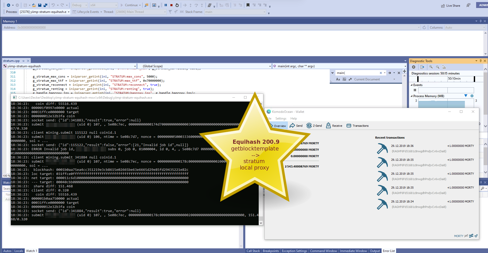

## Yiimp Stratum (Equihash Implementation)

Branch `msvc` can be used to build Equihash stratum for Windows, using Microsoft Visual Studio Community 2019 (Version 16.4.2). Unlike `master` branch which supports all possible protocols, `msvc` branch support only Equihash 200.9 protocol, others doesn't inlclude in project.

### Steps to build

1. Make sura that you have Microsoft Visual Studio Community 2019 installed.
2. Clone the repo and swithch on `msvc` branch.
3. Open solution `yiimp-stratum-equihash.sln`.
4. Download [libsodium-1.0.18-msvc.zip](https://github.com/jedisct1/libsodium/releases/download/1.0.18-RELEASE/libsodium-1.0.18-msvc.zip) archive and extract it's content to `compat/libs` folder. Make sure that `compat\libs\libsodium\x64\Debug\v142\dynamic` folder contains `libsodium.lib`, same for Release configuration. Folder `compat\libs\libsodium\x64\Release\v142\dynamic` should contain `libsodium.lib` also.
5. Download [pthreadVC2.lib](https://github.com/tpruvot/ccminer/raw/windows/compat/pthreads/x64/pthreadVC2.lib) and place it `compat\libs\pthread` folder.
6. Build your solution choosing `Debug` or `Release` configuration.
7. Don't forget to change the coins array [here](https://github.com/DeckerSU/yiimp-stratum-equihash/blob/msvc/db.cpp#L240) before build.
8. Copy `yiimp-stratum-equihash.exe`, `libsodium.dll` and `equihash.conf` in one folder.
9. Start stratum `yiimp-stratum-equihash.exe equihash`.
10. Enjoy ;)

