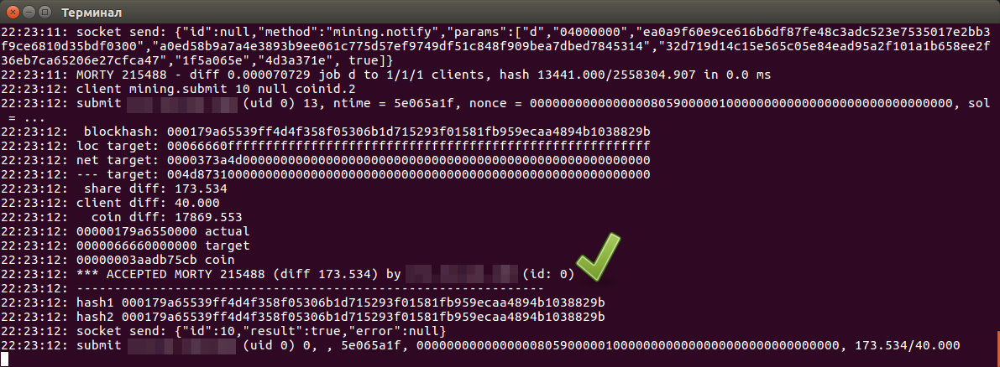
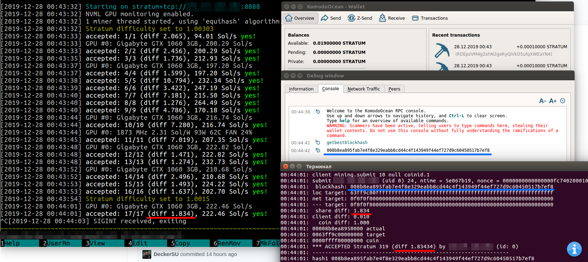

## Yiimp Stratum (Equihash Implementation)

Long-awaited implementation of equihash (200.9) protocol for [Yiimp](https://github.com/tpruvot/yiimp) crypto mining pool. Based on original [stratum sources](https://github.com/tpruvot/yiimp/tree/next/stratum) forked on [this](https://github.com/tpruvot/yiimp/commit/eec1befbd3fba1614db023674361e995e6a62829) commit.

Currently app is in developement state (!), it able to receive `getblocktemplate` from daemons, broadcast job to miners, accept and validate solutions, ~~but it still not able to acquire current network diff to determine when accepted share is a block and when it should be send via `submitblock` to daemon~~. Work in progress, so, follow the updates.

### Features

- Equihash 200.9 support with validating solutions via `verifyEH` function.
- Support of so-called "local mode", which allows stratum binary work without Yiimp installed. In this mode it don't need yimmp mysql database and acts as a proxy between daemon `getblocktemplate` and stratum protocol for miners. To enable this mode use `CFLAGS += -DNO_MYSQL` flag in `Makefile`. Coin daemons credentials should be hardcoded in `coins_data[NUM_COINS][NUM_PARAMS]` array in `db.cpp`.
- Supporting of selecting coins via pass `-c=` param in password field in local (non mysql mode).
- Sapling compatible. This implementation of stratum don't construct coinbase tx by itself, instead of that it simply copies coinbase given by daemon in `coinbasetxn` field of `getblocktemplate`. So, if coin has sapling active coinbase tx will be with version 4 and needed `versiongroupid` set.

### Small Q/A

- How can i enable additional logging to see blockhashes, diffs, etc.?

    Add the following lines in your `equihash.conf`:
    ```
    [DEBUGLOG]
    client = 1
    hash = 1
    socket = 1
    rpc = 0
    list = 1
    remote = 1
    ```
- How can i start Stratum in solo mode?

    Compile it with `NO_MYSQL` flag as mentioned above, then place your `equihash.conf` in same directory with `stratum` binary and start it like `./stratum equihash`. Don't forget to fill coins array in `db.cpp` for solo mode.

- Where exactly should i fill coins array for local mode?

    https://github.com/DeckerSU/yiimp-stratum-equihash/blob/ad5028798aac0be059a37e6afa8b6071544a6aa4/db.cpp#L230 - here. Also, don't forget to change `NUM_COINS` if you plan to add more than one coin.

- Any build instructions for Debian 10 Buster?

    Yes, thx to @ca333 and @ComputerGenie:

    ```
    $ git clone https://github.com/DeckerSU/yiimp-stratum-equihash
    $ cd yiimp-stratum-equihash/
    $ make -C iniparser/ -j$(nproc)
    # apt install default-libmysqlclient-dev
    $ make -C algos/ -j$(nproc)
    $ make -C sha3 -j$(nproc)
    # apt install libnghttp2-dev librtmp-dev libssh2-1 libssh2-1-dev libldap2-dev libidn11-dev libpsl-dev
    # apt install libkrb5-dev
    $ make -f Makefile -j$(nproc)

    ```

    **p.s.** If your default compiler is `gcc 8.3.0 (Debian 8.3.0-6)` you possible will get crash of app after share received. In this case you can try to build `msvc` branch. Do:

    - `make clean`
    - `git checkout msvc`
    - `git pull`
    - rebuild and restart `stratum`

    `msvc` branch already contains some fixes and can be build under Windows (with MSVC) and under Linux (with gcc). So, if you have crash with gcc-8, just try `msvc` branch instead of `master`. This is temporary solution till all needed fixes will be merged in `master` branch.

- What's the relationship between this stratum diff, z-nomp/s-nomp/k-nomp diff and NiceHash diff?

    It's relatively easy, look on following table:

    | Yiimp Stratum | Nomp           | Nicehash              |
    | ------------: | -------------: | --------------------: |
    | 1             | 0.03125 (**1/32**) | 15.058823529 (**256/17**) |
    | 2176          | 68             | 32768                 |
    | 4352          | 136            | 65536                 |
    | 8704          | 272            | 131072                |


### Other

This implementation have two non-documented options, see the line: https://github.com/DeckerSU/yiimp-stratum-equihash/blob/f9e5c48d8e018f4873683883224bfaffad8f50d8/client_submit.cpp#L218

1. With `templ->nbits` stratum will send block to daemon when `share_hash <= net_target` , where net target is calculated from `nbits` received in `getblocktemplate`. 
2. With `templ->nbits_from_target` stratum will send block to daemon when `share_hash <= net_target` also, but `net_target` here will be exactly match `target` from `getblocktemplate` .

Both options are worked as expected.

Let's try to understand it on a small example:

```
04:32:47:  blockhash: 00635db56f0646cedc5091103390b60e30196e9f2d729646c7a11c536ef75d7f
04:32:47: loc target: 007fff80ffffffffffffffffffffffffffffffffffffffffffffffffffffffff
04:32:47: net target: 0000459fba000000000000000000000000000000000000000000000000000000
04:32:47: --- target: 0071a00000000000000000000000000000000000000000000000000000000000
04:32:47:  share diff: 2.576
04:32:47: client diff: 2.000
04:32:47:   coin diff: 14174.652
04:32:47: 0000635db56f0000 actual
04:32:47: 00007fff80000000 target
04:32:47: 000000049f96bf04 coin
```

We received a block candidate from client with hash `00635db56f0646cedc5091103390b60e30196e9f2d729646c7a11c536ef75d7f` . If we will use **(1)** (see above) this hash will be compared with `net target` (which matches `nbist` in `getblocktemplate`) and if `hash <= net target` it will be send to daemon. If we will use **(2)**, int this case hash will be compared with `--- target`, which matches `target` field in `getblocktemplate`. So, options above affects on with which target will be compared block candidate received from miner to determine what is it share or block.

In this example:

- (1) `00635db56` vs. `0000459f` (target from `gbt.nbist`)
- (2) `00635db56` vs. `0071a000` (target from `gbt.target`)


### Useful docs

- https://en.bitcoin.it/wiki/Stratum_mining_protocol
- https://github.com/slushpool/poclbm-zcash/wiki/Stratum-protocol-changes-for-ZCash
- https://github.com/yqsy/notes/blob/58cd486426e474157ac8ef1c17a934d25401b8f1/business/blockchain/bitcoin/%E7%A5%9E%E5%A5%87%E7%9A%84nBits.md
- https://bitcoin.stackexchange.com/questions/30467/what-are-the-equations-to-convert-between-bits-and-difficulty

### Example of work

- MORTY block [#215488](https://morty.kmd.dev/block/000179a65539ff4d4f358f05306b1d715293f01581fb959ecaa4894b1038829b) `000179a65539ff4d4f358f05306b1d715293f01581fb959ecaa4894b1038829b`





### Donate

If you would like to support this project developement, you can simply do it by send some [KMD](https://komodoplatform.com/) or [assetchains](https://blog.komodoplatform.com/komodo-platform-why-assetchains-part-01-164325398efa) on `RHNSpVd5T6efj98CioNQHGLcfAZ6qecnQ6`.

### Credits

- @tpruvot author of Yiimp pool and base of this stratum implementation.

### Warnings

- This is beta software, use it on your own risk!


